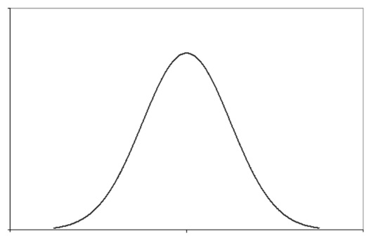
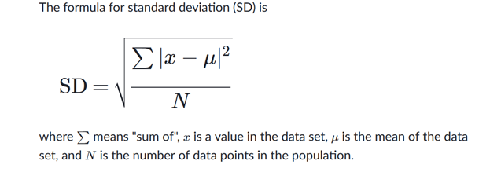

# About this repository 

Using HealthBot, it is easy to collect data from the network devices, to store the data collected in a database, and to use machine learning for anomaly detection or outlier detection.   

- The purpose of the repository documentation is to help peoples with no machine learning background to better understand machine learning basics. It may seem weird to describe how to calculate a standard deviation, a variation, a Euclidean distance, an argmin, … but this is required to fully understand how k-means clustering works.  
- The file [3sigma.xlsx](3sigma.xlsx) computes the three-sigma rule 
- The file [kmeans.xlsx](kmeans.xlsx) computes one iteration of k-means with k=2  
- This repository has also configuration examples of HealthBot using machine learning to detect anomalies.  

# About Machine learning with HealthBot 

HealthBot supports machine learnings for anomaly detection and for outlier detection.  

HealthBot supports the following machine learning algorithms for anomaly detection: 
- Three-sigma rule 
- k-means for anomaly detection 

HealthBot supports the following machine learning algorithms for outlier detection:  
- DBSCAN (Density-Based Spatial Clustering of Applications with Noise) 
- K-fold Three-sigma ("K-Fold Cross-Validation" using "Three-sigma") 

Anomaly detection and outlier detection are both about detecting anomalies.  

In HealthBot terminology:  
- anomaly detection is time based. It compares new data points from a device vs data points collected from the same device during a learning period.  
- outlier detection is group based. It analyzes data from a device during a learning Period vs data from other devices during the same learning period

# Supervised learning

Learning with a teacher.  
The machine learning algorithm learns on a labeled dataset  

# Unsupervised learning 

Learning without a teacher.  
The machine learning uses unlabeled dataset.  
The advantage of using an unsupervised technique is that we do not need to have labeled data, i.e., we do not need to create a training dataset that contains examples of outliers.  
k-means clustering and DBSCAN are unsupervised clustering machine learning algorithms.  
They group the data that has not been previously labelled, classified or categorized.  

# Machine learning model 

This is the output generated when you train your machine learning algorithm with your training data-set.  
The machine learning model is what you get when you run the machine learning algorithm over your training data.  
Once The machine learning model is built, it can be used to classify new data points.  

# Normal distribution  

Also called: Bell curve, Gaussian distribution, Gauss distribution, Laplace–Gauss distribution  

A "normally distributed" data set has most of the data aggregates around its mean in a symmetric fashion. Values become less and less likely to occur the farther they are from the mean.  
Think about a factory producing 1 kg bags of sugar. They won’t always make each exactly 1 kg. In reality, the bags are around 1 kg. Most of the time they will be very close to 1 kg, and very rarely far from 1 Kg.  

Example of normally distributed data: height of adults  
  

#  Standard deviation 

##  Overview

A measure that is used to quantify the amount of variation of a set of data values.  
- A low standard deviation indicates that the data points tend to be close to the mean of the set.  
- A high standard deviation indicates that the data points are spread out over a wider range of values.  

Its symbol is σ (the greek letter sigma)  

## Formula 

## Calculate it by hand 

