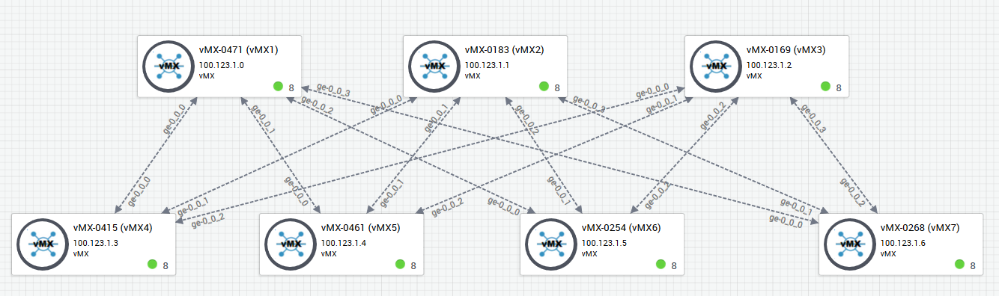

# About this repository 

Using HealthBot, it is easy to collect data from the network devices, to store the data collected in a database, and to use machine learning for anomaly detection or outlier detection.   

In this repository, you will find: 
- The file [machine_learning_with_HealthBot.pdf](machine_learning_with_HealthBot.pdf). The purpose of this document is:  
    - to help peoples with no machine learning background to better understand machine learning basics 
    - to describe machine learning usage with Healthbot  
- The file [3sigma.xlsx](3sigma.xlsx). It computes the three-sigma rule 
- The file [kmeans.xlsx](kmeans.xlsx). It computes one iteration of k-means with k=2  
- Automation content to configure HealthBot:
  - Healthbot will use openconfig to collect data from Junos devices 
  - Healthbot will store the data collected in its database
  - Healthbot will process the data collected and use machine learning algorithms to detect anomaly   

# About HealthBot 

You can use HealthBot to collect data from the network devices, store the data collected in its database, process the data collected.  
Here's the HealthBot documentation https://techlibrary.juniper.net/documentation/product/en_US/contrail-healthbot 

# About HealthBot and machine learning 

HealthBot supports machine learnings for anomaly detection and for outlier detection.  

HealthBot supports the following machine learning algorithms for anomaly detection:  
- Three-sigma rule  
- k-means for anomaly detection  

HealthBot supports the following machine learning algorithms for outlier detection: 
- DBSCAN (Density-Based Spatial Clustering of Applications with Noise)
- K-fold Three-sigma ("K-Fold Cross-Validation" using "Three-sigma")

Anomaly detection and outlier detection are both about detecting anomalies.  
In HealthBot terminology:  
- anomaly detection is time based. It compares new data points from a device vs data points collected from the same device during a learning period.  
- outlier detection is group based. It analyzes data from a device during a learning Period vs data from other devices during the same learning period

For more details, please refer to the file [machine_learning_with_HealthBot.pdf](machine_learning_with_HealthBot.pdf). 

# lab building blocks   

- Junos devices 
- One Ubuntu VM with healthbot

# lab topology

Here's the lab topology I am using.  
You can use less Junos devices if you want
  

# lab management IP addresses 

Here are the management ip addresses I am using in my scripts.  
You can use less Junos devices if you want

| Device        | Management IP address           |
| ------------- |:-------------:| 
| healthbot        | 100.123.35.0 |
| vMX1      | 100.123.1.0 |
| vMX2      | 100.123.1.1   |
| vMX3      | 100.123.1.2   |
| vMX4      | 100.123.1.3   |
| vMX5      | 100.123.1.4   |
| vMX6      | 100.123.1.5   |
| vMX7      | 100.123.1.6   |

# Junos packages

In order to collect data from Junos using openconfig telemetry, the devices require the Junos packages ```openconfig``` and ```network agent```

Starting with Junos OS Release 18.3R1: 
- the Junos OS image includes the ```OpenConfig``` package; therefore, you do not need anymore to install ```OpenConfig``` separately on your device.  
- the Junos OS image includes the ```Network Agent```, therefore, you do not need anymore to install the ```network agent``` separately on your device.  

This setup is using an older Junos release, so it is required to install these two packages. 

Download these two packages from Juniper website and save them in your local directory.    

Execute the python script [upgrade_junos.py](upgrade_junos.py) to add these two packages to the Junos devices indicated in this [inventory.yml](inventory.yml) file   

Install the requirements:
```
$ sudo apt install python-pip
$ pip install junos-eznc
```
Update the devices inventory: 
```
$ vi inventory.yml
```
Run this command to execute the python script [upgrade_junos.py](upgrade_junos.py)
```
$ python ./upgrade_junos.py
```
ssh to a Junos device and verify it uses these packages:
```
jcluser@vMX1> file list

/var/home/jcluser/:
junos-openconfig-x86-32-0.0.0.10-1.tgz
network-agent-x86-32-18.2R1-S3.2-C1.tgz

```
```
jcluser@vMX1> show version | match "Junos:|openconfig|na telemetry"
Junos: 18.2R1.9
JUNOS na telemetry [18.2R1-S3.2-C1]
JUNOS Openconfig [0.0.0.10-1]
```

# Junos configuration

we will the python script [configure_junos.py](configure_junos.py) to configure the lab.

This script uses: 
- the template [junos.j2](configure_junos/junos.j2) 
- the variables [junos.yml](configure_junos/junos.yml) 

It generates the junos configuration for each device in the [inventory.yml](inventory.yml) file and load the junos configuration on devices.  
 
Install the requirements: 
```
$ sudo apt install python-pip
$ pip install junos-eznc
$ pip install jinja2
```
Run this command to update the devices inventory file:
```
$ vi inventory.yml
```
Run this command to configure the lab:  
```
$ python configure_junos.py
configured device vMX1
configured device vMX2
configured device vMX3
configured device vMX4
configured device vMX5
configured device vMX6
configured device vMX7
```
The generated junos configuration files are saved in the directory [configure_junos](configure_junos).  
```
$ ls configure_junos
```
ssh to a junos device and check bgp sessions state. The sessions should be established.  
To audit BGP sessions using Python, run this command: 
```
$ python audit_junos.py
vMX1
bgp session with peer 192.168.1.1+179 is Established
bgp session with peer 192.168.1.3+179 is Established
bgp session with peer 192.168.1.5+179 is Established
bgp session with peer 192.168.1.7+61628 is Established
vMX2
bgp session with peer 192.168.2.1+179 is Established
bgp session with peer 192.168.2.3+179 is Established
bgp session with peer 192.168.2.5+179 is Established
bgp session with peer 192.168.2.7+179 is Established
vMX3
bgp session with peer 192.168.3.1+179 is Established
bgp session with peer 192.168.3.3+64639 is Established
bgp session with peer 192.168.3.5+179 is Established
bgp session with peer 192.168.3.7+61672 is Established
vMX4
bgp session with peer 192.168.1.0+55338 is Established
bgp session with peer 192.168.2.0+63710 is Established
bgp session with peer 192.168.3.0+55353 is Established
vMX5
bgp session with peer 192.168.1.2+57685 is Established
bgp session with peer 192.168.2.2+61875 is Established
bgp session with peer 192.168.3.2+179 is Established
vMX6
bgp session with peer 192.168.1.4+55251 is Established
bgp session with peer 192.168.2.4+58983 is Established
bgp session with peer 192.168.3.4+53866 is Established
vMX7
bgp session with peer 192.168.1.6+179 is Established
bgp session with peer 192.168.2.6+59682 is Established
bgp session with peer 192.168.3.6+179 is Established

```

# Machine learning for anomaly detection demo (demo with the number of BGP prefixes received)

In this demo, Healthbot will continuously monitor the number of bgp prefixes received (using Openconfig telemetry), store the data collected in its database, and use machine learning for anomaly detection to classify the new datapoints as normal or abnormal.  

The rule [check-bgp-state-using-openconfig.rule](rules/check-bgp-state-using-openconfig.rule) uses OpenConfig telemetry to monitor BGP sessions state (without machine learning)  

The rule HealthBot [check-bgp-routes.rule](rules/check-bgp-routes.rule) uses OpenConfig telemetry to monitor the number of BGP prefixes received per peer, and uses a static threshold (provided as a variable) (without machine learning).  

The rule [check-bgp-routes-with-3-sigma.rule](rules/check-bgp-routes-with-3-sigma.rule) uses Openconfig telemetry to continuously monitor the number of bgp prefixes received, and uses **3 sigma** rule to classify the new datapoints as `normal` or `abnormal`  

The rule [check-bgp-routes-with-k-means.rule](rules/check-bgp-routes-with-k-means.rule) uses Openconfig telemetry to continuously monitor the number of bgp prefixes received and uses **k-means** machine learning algorithm to classify the new datapoints as `normal` or `abnormal`  

The playbook [machine-learning-for-bgp.playbook](playbooks/machine-learning-for-bgp.playbook) monitors the number of BGP prefixes received using the rules:
- [check-bgp-state-using-openconfig](rules/check-bgp-state-using-openconfig.rule) (BGP sessions monitoring)  
- [check-bgp-routes](rules/check-bgp-routes.rule) (static threshold without machine learning)  
- [check-bgp-routes-with-3-sigma](rules/check-bgp-routes-with-3-sigma.rule) (dynamic threshold with 3 sigma)   
- [check-bgp-routes-with-k-means](rules/check-bgp-routes-with-k-means.rule) (dynamic threshold with k means)   

Run the script [configure_machine_learning.py](configure_machine_learning.py) to:   
- load to Healthbot the playbook [machine-learning-for-bgp.playbook](playbooks/machine-learning-for-bgp.playbook)
- load to Healthbot the rules [check-bgp-routes](rules/check-bgp-routes.rule) and [check-bgp-routes-with-3-sigma](rules/check-bgp-routes-with-3-sigma.rule) and [check-bgp-routes-with-k-means](rules/check-bgp-routes-with-k-means.rule) and 
[check-bgp-state-using-openconfig](rules/check-bgp-state-using-openconfig.rule)
- create a device-group `vmx` with devices `vMX1` to `vMX7` 
- instanciate the playbook [machine-learning-for-bgp.playbook](playbooks/machine-learning-for-bgp.playbook) against the device-group `vmx`  

```
$ python configure_machine_learning.py
loaded healthbot rule check-bgp-state-using-openconfig.rule
loaded healthbot rule check-bgp-routes.rule
loaded healthbot rule check-bgp-routes-with-k-means.rule
loaded healthbot rule check-bgp-routes-with-3-sigma.rule
loaded healthbot playbook machine-learning-for-bgp.playbook
loaded healthbot configuration for the device: vMX1
loaded healthbot configuration for the device: vMX2
loaded healthbot configuration for the device: vMX3
loaded healthbot configuration for the device: vMX4
loaded healthbot configuration for the device: vMX5
loaded healthbot configuration for the device: vMX6
loaded healthbot configuration for the device: vMX7
loaded healthbot configuration for the device group: vmx
healthbot configuration commited!
$
```

## Update the number of BGP prefixes received  

To update the number of BGP prefixes received, we will use the python script [update_routes.py](https://github.com/ksator/junos_monitoring_with_healthbot/blob/master/machine_learning/update_routes.py).  
This script uses the template [update_routes.j2](https://github.com/ksator/junos_monitoring_with_healthbot/blob/master/machine_learning/update_routes.j2).  
It generates a junos configuration file every 60 seconds with 101 to 109 static routes (randomly), and loads this file to the Junos device vMX1 (using the replace option).  
This junos device vMX1 uses BGP and advertises its static routes to its BGP peers.   
Healthbot collects BGP prefixes received.  
So when we run the python script [update_routes.py](https://github.com/ksator/junos_monitoring_with_healthbot/blob/master/machine_learning/update_routes.py), it makes the number of BGP prefixes received on vMX1 peers changing every 60 seconds  

Run this command to execute the python script [update_routes.py](https://github.com/ksator/junos_monitoring_with_healthbot/blob/master/machine_learning/update_routes.py).  
```
$ python machine_learning/update_routes.py
```
Run these commands to verify: 
```
$ ps -ef | grep update_routes.py
$ ls junos_monitoring_with_healthbot/machine_learning/ -la
$ date
```
Run these commands on vMX1 (ip 100.123.1.0) to verify:
```
jcluser@vMX-addr-0> show system commit
jcluser@vMX-addr-0> show system uptime
jcluser@vMX-addr-0> show configuration | compare rollback 1
jcluser@vMX-addr-0> show configuration routing-options static
jcluser@vMX-addr-0> show route advertising-protocol bgp 192.168.1.1
```
Run this command on vMX1 peer (ip 100.123.1.4 as example) to see the number of BGP prefixes received 
```
jcluser@vMX-addr-4> show bgp summary
```


